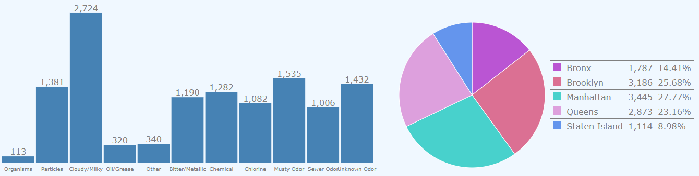
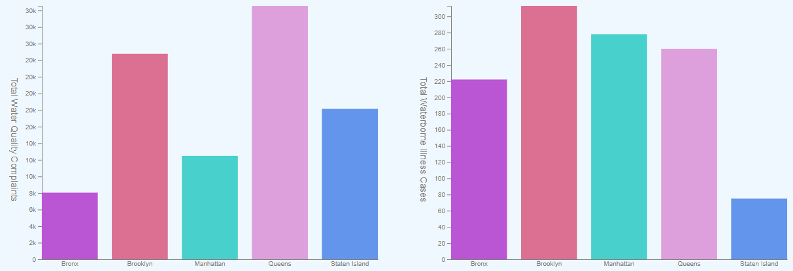
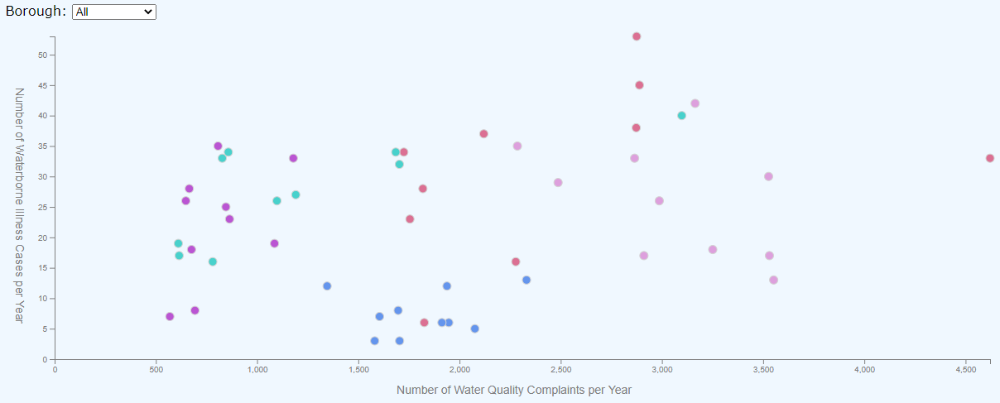

# [Final Portfolio for Interactive Data Visualization](https://sheri-kamal.github.io/DATA73200-SP2020/)
Projects for Interactive Data Visualization (Using D3.js), Spring 2020

## [Project 1 - Exploratory Visualization](https://sheri-kamal.github.io/DATA73200-SP2020/Exploratory/)

For my exploratory visualization project, I wanted to explore various water quality complaints in New York City from 2010 to 2019. I created a dashboard made up of a bar chart, a pie chart, and a legend for this exploration. If you hover over a bar the pie chart and legend updates to show the borough breakdown of that water quality complaint. If you hover a borough pie slice the bar chart updates to show the water quality complaint breakdown for that borough. This visualization shows us which boroughs have the most water quality complaints and the type of water quality complaints each borough make the most.

My project and design process can be found [here](https://github.com/sheri-kamal/DATA73200-SP2020/tree/master/Exploratory).

## [Project 2 - Narrative Visualization](https://sheri-kamal.github.io/DATA73200-SP2020/Narrative/)

 

My narrative visualization is an expansion on my exploratory visualization project where I am also looking at waterborne illness cases to determine if there is a relationship between water quality complaints and cases of waterborne illness. The bar charts depicting the total number of water quality complaints and the total number of cases of waterborne illness by borough are used as a comparison so that it is easy to see which boroughs have the highest number of water quality complaints and which have the highest number of waterborne illness cases. If water quality and waterborne illness are related then we would expect the boroughs with the highest number of complaints and cases to be the same or at least similar. The scatter plot is a better way of showing the relationship between the two. The scatter plot also includes a dropdown filter that can be used to see the relationship between the two for individual boroughs as well as the overall relationship.

My project and design process can be found [here](https://github.com/sheri-kamal/DATA73200-SP2020/tree/master/Narrative).

## [Project Reflections](https://github.com/sheri-kamal/DATA73200-SP2020/blob/master/Final%20Portfolio%20Reflections.pdf)
